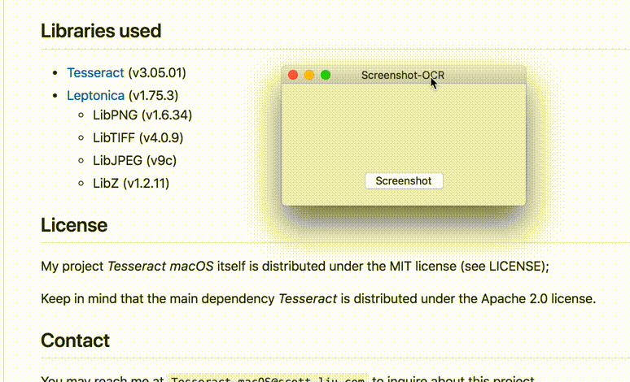
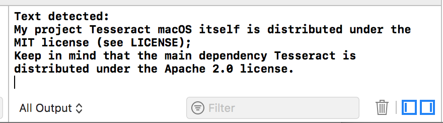
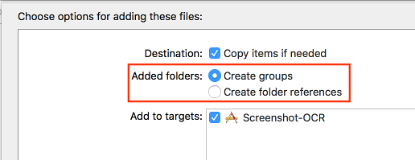

# Tesseract macOS
[](https://travis-ci.org/scott0123/Tesseract-macOS)
[](https://github.com/scott0123/Tesseract-macOS/blob/master/LICENSE)
[](https://github.com/scott0123/Tesseract-macOS)


This is an open-source macOS-based Objective-C wrapper for the OCR library *Tesseract*.

As far as I know, mine is the only working version ported to macOS.

Star this repo if you find it helpful, fork this repo if you want to experiment with it. :)

## Demo Application

For those of you who wish to first test out the OCR capabilities, I have created a demo application that lets you do just this.

First build the Xcode project included in this repository. This will generate an application through wish you can take a screenshot, as shown in the following gif.



In the Xcode log you will find the corresponding text Tesseract detected for this screenshot.



## Getting Started

### Getting this to work in your own project

1. Clone this project
2. Copy over the `include`, `lib`, and `tessdata` folders to your project.
3. Add these folders to your project in Xcode. Make sure `include` and `lib` are added as *groups* and `tessdata` is added as a *folder reference*. 

	The location of this setting is shown in the following image:

	

4. Copy over the files `SLTesseract.mm` and `SLTesseract.h` to your code directory.
5. Verify that the file `SLTesseract.mm` is added to `Targets > Build Phases > Compile Sources`. Additionally, verify that all the static libraries are also added to `Targets > Build Phases > Link Binary With Libraries`. (This process should be done automatically)
6. You are now ready to use Tesseract in your macOS project. (See Example Usage for code syntax)

### Dependencies

None so far.

## Example Usage

At the top of the file include the header file

```
#import "SLTesseract.h"
```

And then

```
SLTesseract *ocr = [[SLTesseract alloc] init];
```

will initiallize the class SLTesseract. 

(optional) `ocr.language = @"eng";`

(optional) `ocr.charWhitelist = @"abcdefghijklmnopqrstuvwxyz"`

(optional) `ocr.charBlacklist = @"1234567890"`

Finally, assuming you already have the image that you wish to perform OCR on in NSImage form, you can call

```
NSString *text = [ocr recognize:image];
```

to recognize the image in question and get the corresponding text.


## Libraries Used

* [Tesseract](https://github.com/tesseract-ocr/tesseract) (v3.05.01)
* [Leptonica](http://leptonica.org/) (v1.75.3)
	* LibPNG (v1.6.34)
	* LibTIFF (v4.0.9)
	* LibJPEG (v9c)
	* LibZ (v1.2.11)

## License

My project *Tesseract macOS* itself is distributed under the MIT license (see LICENSE);

Keep in mind that the main dependency *Tesseract* is distributed under the Apache 2.0 license.

## Contact

Open an issue if you want something fixed.

You may reach me at `Tesseract-macOS@scott-liu.com` to inquire about this project.

## Used by

* [Handwriting-Input-Recognition](https://github.com/chargeflux/Handwriting-Input-Recognition) by [chargeflux](https://github.com/chargeflux)

